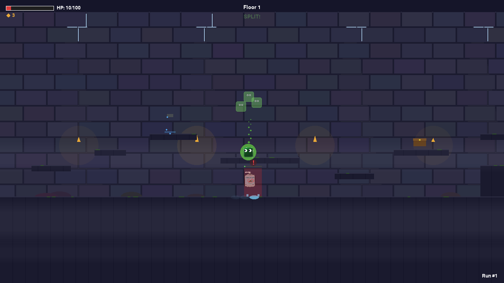
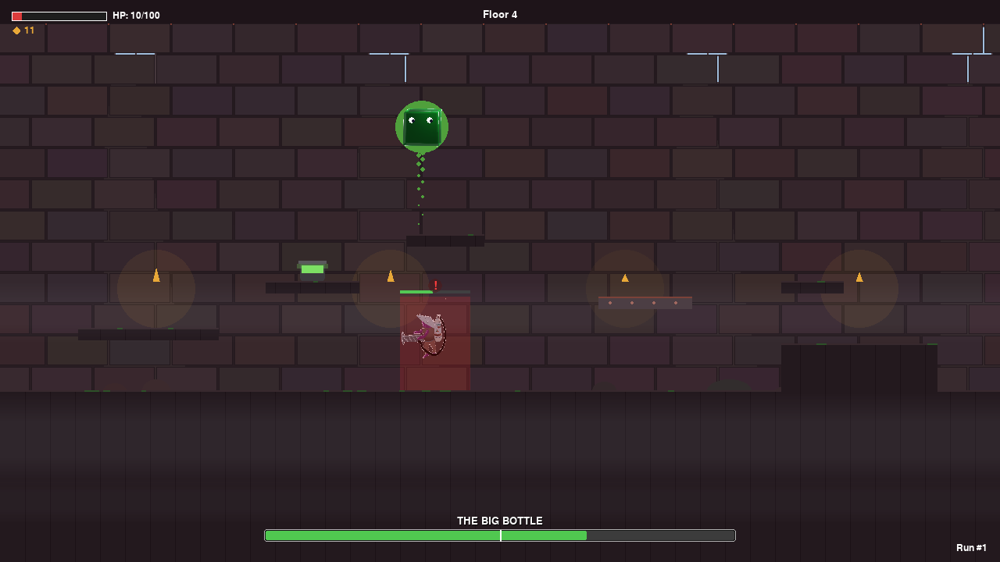
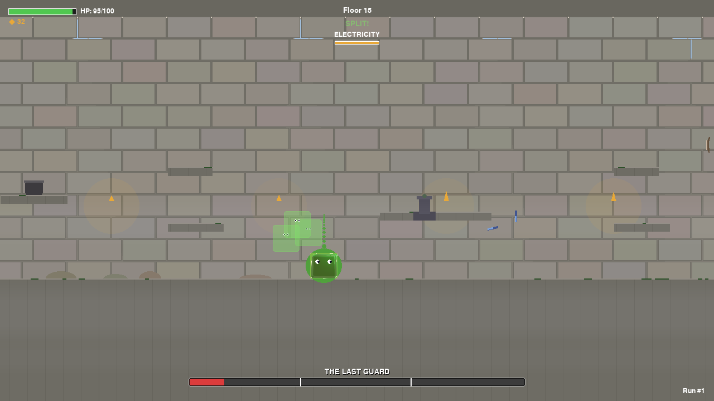

# SPLIT

A 2D platformer designed by four kids and built by AI -- on a Raspberry Pi 5.

Four kids ages 9-12 spent five sessions designing a video game from scratch. They chose every character, mechanic, level, and boss fight. Claude Code wrote the code from their direction. The result is SPLIT: a 15-floor castle escape where you play as a jello cube whose health is also its ammo. The game was built for their school's Inquiry Exhibition in March 2026 and runs natively on a Raspberry Pi 5 with a Nintendo Switch Pro Controller.

<p align="center">
  
  
  
</p>

## The Game

You are a jello cube trapped at the bottom of a dark castle. The only way out is up through 15 floors of enemies, puzzles, and boss fights. Your body mass is your health and your ammo -- every shot you fire shrinks you, and every hit you take costs mass. You can split into pieces to solve puzzles, cook jello powder at crafting stations to heal, and collect elemental pills from hidden shrines.

- 15 floors with progressive difficulty and distinct visual themes
- 5 bosses, each with multi-phase combat and unique mechanics
- 3 enemy types with different AI behaviors
- Mass-based health system where attacking costs body mass
- Split mechanic that breaks you into pieces for puzzles and secrets
- Crafting system with cooking pots (jello powder + water + heat)
- 8 hidden easter eggs, including a fourth-wall break and a secret NPC
- 4 difficulty modes: Easy, Normal, Hard, and Earthquake (timed castle collapse)
- Procedurally synthesized sound effects (no audio files needed)
- Dynamic music that shifts with each floor zone
- Interactive credits corridor and opening cinematic
- Full Nintendo Switch Pro Controller support with keyboard fallback
- Automated playtest harness with frame-by-frame state logging

## Run It

### On any computer

```bash
git clone https://github.com/mtblackman16/quest-craft.git
cd quest-craft
pip install pygame
python -m game.main
```

Requires Python 3.11 or newer. Keyboard controls work out of the box. Controller support requires a Nintendo Switch Pro Controller paired via Bluetooth.

### On a Raspberry Pi 5

The game was built and tested on a Pi 5 running Arch Linux with Wayland and PipeWire. See [docs/guides/prerequisites.md](docs/guides/prerequisites.md) for setup and [docs/guides/headless-setup.md](docs/guides/headless-setup.md) for remote display via VNC. The launcher script handles display and audio configuration:

```bash
./launch.sh
```

### Keyboard Controls

| Action | Key |
|--------|-----|
| Move | WASD |
| Jump | Space |
| Shoot | Z |
| Eat / Heal | X |
| Interact | C |
| Split | Q |
| Dodge | E |
| Switch split piece | Tab |
| Inventory | I |
| Pause | Esc |

Full controller mapping with button indices is in [docs/prds/07-controls.md](docs/prds/07-controls.md).

## How It Was Built

The game was designed and built across five sessions over about two weeks. The kids spoke their ideas using Wispr Flow (voice-to-text), and Claude Code turned those ideas into working Python. By the end of Session 4, the team had found and fixed 62 bugs through a combination of hands-on playtesting and an automated test harness that runs all 15 floors.

| Session | Focus | What Happened |
|---------|-------|---------------|
| 1. Dream | Game concept | Brainstormed the jello cube idea, defined the core mechanic, named the game |
| 2. Design | Deep design | Wrote 7 design documents covering characters, world, gameplay, levels, art, sound, and controls |
| 3. Blueprint | Technical plan | Claude translated the design into architecture, kids tested controllers on the Pi |
| 4. Playtest | Bug hunting | Played the real game, found 62 bugs, fixed them in real time with Claude |
| 5. Showcase | Exhibition prep | Built the display board, recorded reflections, rehearsed the demo |

Full session guides are in [docs/sessions/](docs/sessions/).

## Replicate This

You don't need a Raspberry Pi or these specific kids. You need the framework.

1. A computer with Python installed
2. An AI coding assistant (Claude Code, Cursor, or similar)
3. A voice input method like Wispr Flow (optional, but it changes everything for young kids)
4. The [5-session framework](docs/sessions/) -- each session guide has goals, activities, and expected outcomes
5. A game controller (optional but recommended for playtesting)

The design documents in [docs/prds/](docs/prds/) show the depth of work the kids produced across 7 topics. They can serve as templates for your own project. The [project constitution](.claude/CLAUDE.md) defines how the team and AI worked together.

## Project Structure

```
quest-craft/
├── game/                  # All game code (~16,000 lines of Python)
│   ├── main.py            # Entry point and state machine
│   ├── engine/            # Camera, settings, asset loading
│   ├── entities/          # Player, enemies, bosses (5 boss types)
│   ├── world/             # Platforms, interactables, level loading
│   ├── systems/           # Combat, crafting, music, sound, VFX, secrets, stealth
│   ├── ui/                # Title screen, opening cinematic, menus, credits
│   └── testing/           # Automated playtest harness and analysis
├── assets/
│   ├── images/            # Andrew's hand-drawn character art and sprites
│   ├── screenshots/       # Exhibition gameplay screenshots
│   └── sounds/            # Sound asset directory (SFX are synthesized at runtime)
├── docs/
│   ├── prds/              # 8 game design documents (concept through controls)
│   ├── sessions/          # 5 session guides (Dream through Showcase)
│   ├── guides/            # Setup, voice prompting, exhibition checklist
│   ├── exhibition/        # Display board HTML pages and printable PDFs
│   ├── parent-summaries/  # Session recap pages for parents
│   ├── learning/          # Learning logs and build records
│   └── plans/             # Master plan and QA strategy
├── .claude/               # Project constitution and slash commands
├── memory/                # Claude's cross-session memory
├── scripts/               # Launcher and VNC startup scripts
└── launch.sh              # Pi environment launcher
```

## Tech Stack

- Python 3.13 + Pygame 2.6.1 (only external dependency)
- Raspberry Pi 5 (Arch Linux, Wayland compositor, PipeWire audio)
- Nintendo Switch Pro Controller via Bluetooth
- Claude Code (AI engineering partner)
- Wispr Flow (voice-to-text for the kids)
- Git + GitHub for version control
- ~16,000 lines of Python across 39 files

## The Team

- Ethan (9) -- Game Designer, Co-creator
- Eins (12) -- Game Designer, Co-creator
- Andrew (12) -- Artist, Visual Designer, Co-creator
- Nathan (9) -- Game Designer, Co-creator
- Mark -- Team Advisor (adult facilitator)

Andrew drew every character and item by hand. His illustrations were processed into game-ready sprites. Ethan, Eins, and Nathan designed every mechanic, enemy, boss, and level through voice sessions with Claude.

## Documentation

| Folder | What's Inside |
|--------|---------------|
| [docs/prds/](docs/prds/) | 8 game design documents, from concept to controls |
| [docs/sessions/](docs/sessions/) | 5 session guides with goals, activities, and outcomes |
| [docs/guides/](docs/guides/) | Pi setup, voice prompting tips, exhibition checklist |
| [docs/exhibition/](docs/exhibition/) | Display board pages and printable PDFs |
| [docs/learning/](docs/learning/) | Learning logs and build records from playtesting |
| [docs/parent-summaries/](docs/parent-summaries/) | HTML session recaps for parents |

## License

This is a school project. Open source for learning purposes. Made by Ethan, Eins, Andrew, and Nathan.
